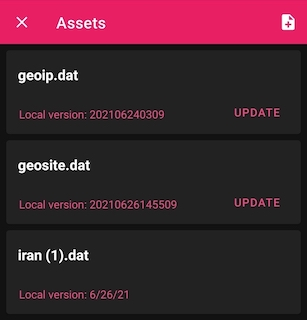

<div dir=rtl>

#  دامنه‌های میزبانی شده در ایران

- [English Document](README.md)

بسیاری از سرویس‌ها و دامنه‌های خارج از ایران سانسور و مسدود شده‌اند و باید برای دسترسی به آن‌ها از VPN و Proxy هایی با امنیت بالا استفاده کنیم، جدای از این مسئله دسترسی به بعضی سرویس‌های ایرانی از طریق IP خارجی مسدود شده است. حال برای رد کردن این سرویس ها لیستی از دامنه‌های داخلی را جمع کرده‌ایم تا با اضافه کردن آن‌ به کلاینت‌های مورد استفاده، دیگر نیاز به قطع کردن VPN برای دسترسی به سرویس‌های داخلی نباشد.

## سلب مسئولیت
  این مخزن فهرستی گردآوری شده از منابع عمومی و در دسترس مردم در مورد وب سایت های میزبانی شده در ایران است. این فقط برای مقاصد اطلاعات عمومی در نظر گرفته شده است و برای ارائه راهنمایی در مورد نحوه اتصال یا ایجاد یا مدیریت یک شبکه خصوصی مجازی (VPN) در نظر گرفته **نشده** است. محتوای این مخزن همانطور که هست ارائه شده است و ما هیچ گونه اظهارنظر یا ضمانتی، صریح یا ضمنی، در مورد کامل بودن، دقت، قابلیت اطمینان، مناسب بودن یا در دسترس بودن اطلاعات موجود در این مخزن نداریم. هر گونه اتکای شما به چنین اطلاعاتی کاملاً به عهده شماست. ما مسئولیتی در قبال خطاها یا حذفیات در اطلاعات یا هر گونه ضرر، خسارت یا سایر تعهدات ناشی از استفاده از آن نخواهیم داشت. لطفاً قبل از استفاده از هر گونه اطلاعات این مخزن احتیاط کنید و با یک متخصص واجد شرایط مشورت کنید.
  


## روش استفاده

بسته به اینکه از کدام کلاینت استفاده می‌کنید، ممکن است متفاوت باشد.  لیست دامنه‌ها و فایل‌های مربوط را می‌توانید از [این صفحه][link-release] دریافت کنید.  
برای سیستم routing بهتر در کلاینت‌های v2ray شما می‌توانید پارامتر `Domain Resolution Strategy` را به `IPIfNonMatch` تغییر دهید. [اطلاعات بیشتر](https://www.v2ray.com/en/configuration/routing.html) 


### [Qv2ray](https://github.com/Qv2ray/Qv2ray)


شما می‌توانید فایل qv2ray_schema.json را در [این صفحه][link-release] پیدا کنید.
  
1. فایل را دانلود کنید.
2. در بخش `preferences` بر روی `Advanced Route Settings` کلیک کنید.
3. در پایین صفحه، بر روی `import schema...` کلیک کنید.
4. فایل qv2ray_schema.json دانلود شده را انتخاب کنید.
5. در کادر باز شده بر روی yes کلیک کنید.
6. بر روی OK کلیک کنید.


### .dat file

این فایل در تمامی کلاینت‌های v2ray
  v2fly و xray قابل استفاده است.

1. فایل `iran.dat` را از [این صفحه][link-release] دانلود کنید.
2. فایل را در کلاینت خود کپی و یا وارد کنید.  
  به عنوان مثال:
    - v2ray macOS: `/usr/local/share/v2ray`  
3. قوانین مناسب را اضافه کنید:
    - `ext:iran.dat:ir`
    - `ext:iran.dat:other`
    - `ext:iran.dat:ads`
4. اتصال خود را قطع و وصل کنید.


  
### [SagerNet](https://github.com/SagerNet/SagerNet)


1. فایل `iran.dat` را از [این صفحه][link-release] دانلود کنید.
2. فایل را از طریق `Route -> Three dots -> Manage Route Assets`  به کلاینت اضافه کنید.  
3.  از بخش  `Route -> Create Route` قوانین زیر را اضافه کنید:   
</div>  

- Block Ads:
  - domain: `geosite:category-ads-all`
  - outbound: `Block`
- Block Iran Ads:
  - domain: `ext:iran.dat:ads`
  - outbound: `Block`
- Bypass Iran .ir Domains:
  - domain: `regexp:.+\.ir$`
  - outbound: `Bypass`
- Bypass Iran non .ir Domains:
  - domain: `ext:iran.dat:other`
  - outbound: `Bypass`
- Bypass Iran geoip:
  - ip: `geoip:ir`
  - outbound: `Bypass`

<div dir=rtl>  

> برای مشاهده‌ی اسکرین شات از قوانین بالا [اینجا کلیک کنید](https://imgur.com/a/SEq1Bvg).

4. اتصال خود را قطع و وصل کنید.  

### [Shadowrocket](https://apps.apple.com/us/app/shadowrocket/id932747118)

1. فایل `shadowrocket.conf` را دانلود کنید.
2. در اپلیکیشن بر روی `Import From Cloud` کلیک کرده و فایل مربوط را اضافه کنید.
3. در نهایت، بر روی `shadowrocket.conf`کلیک کرده و `Use Config` را انتخاب کنید.

<table>
  <tr>
    <td>   </td>
    <td>   </td>
   </tr>
  </tr>
</table>

### [Clash](https://github.com/Dreamacro/clash) (Like [ClashX](https://github.com/yichengchen/clashX) / [clash_for_windows_pkg](https://github.com/Fndroid/clash_for_windows_pkg) / [Clash .NET](https://github.com/ClashDotNetFramework/ClashDotNetFramework/releases) / ...)

1. صفحه‌ی پروفایل/تنظیمات فعلی خود را که استفاده می‌کنید باز کنید.  
2. این خطوط را به فایل اضافه کنید:  
```yaml
rule-providers:
  iran:
    type: http
    behavior: classical
    url: "https://github.com/bootmortis/iran-hosted-domains/releases/latest/download/clash_rules.yaml"
    path: ./ruleset/iran.yaml
    interval: 432000
```

3. سپس خط زیر را به بخش قوانین `Rules` اضافه کنید:  
```yaml
  - RULE-SET,iran,DIRECT
```

4. فایل را ذخیره کنید.  
5. بستگی به نوع کلاینت، ممکن است لازم باشد نرم‌افزار را روی حالت `Rule‍` تنظیم کنید.  

   
### [V2rayNG](https://github.com/2dust/v2rayNG)

1. ابتدا فایل `iran.dat` را از [این صفحه][link-release] دانلود کنید و در گوشی خود با اپ مدیریت فایل به مسیر `Android/data/com.v2ray.ang/files/assets` منتقل کنید.
2. بعد توی `Setting` برنامه تو بخش `Routing` مطمئن بشید که `Domain Strategy` رو حالت `IpIfNonMatch` باشه:

[تصویر](https://imgur.com/3znAoM6)
  
3. رو `Custom rules` تپ کنید. تو سربرگ `Direct URL or IP` بنویسید:

  `ext:iran.dat:ir`

[تصویر](https://imgur.com/jhXd8XW)
  
تو سربرگ `Blocked URL or IP` بنویسید:
  `ext:iran.dat:ads`
  
  تو سربرگ `Proxy URL or IP` بنویسید:
  `ext:iran.dat:other`
  
بعد هم اوکی کنید و تمام.
  
  
### [V2Ray Server](https://www.v2ray.com/en/configuration/routing.html)

 شما می‌توانید ترافیک سایت‌های ایرانی را در سرور v2ray خود نیز تفکیک کنید و مستقیم صدا بزنید.
1. برای این منظور ابتدا باید فایل `iran‪.‬dat` را از [این صفحه][link-release] در سرور خود در کنار فایل `geoip‪.‬dat` و یا `geosite‪.‬dat` انتقال دهید.
 این مسیر بسته به نحوه نصب v2ray ممکن است یکی از مسیرهای زیر باشد :

`/usr/local/x-ui/bin/`

`/usr/local/etc/v2ray/`

`/etc/v2ray/`

‬اگر  فایل `dat` در هیچ‌کدام از مسیرهای بالا نبود با این دستور مسیر مورد نظر را پیدا کنید:

 `find / -iname "geo*.dat"`

بعد از پیدا کردن مسیر مقصد به آن فولدر بروید:

`cd /usr/local/x-ui/bin`

و بعد از اینکه لینک فایل `iran‪.‬dat`را استخراج کردید مشابه دستور زیر آن را دانلود کنید:

`wget https://github.com/bootmortis/iran-hosted-domains/releases/download/202212110113/iran.dat`

2.  حالا باید v2ray را طوری تنظیم کنیم که برای بارگذاری سایت‌های ایرانی از دیتابیس `iran.dat` که در مرحله قبل اضافه کردیم و الگوی regex سایت‌های ir استفاده کند. برای اینکار باید فایل `config‪.‬json` (که در همان مسیر قبلی‌ست) را ویرایش کنیم. اگر از پنل x‪-‬ui استفاده می‌کنید از قسمت `PanelSettings/XRAYConfiguration` هم می‌توانید این فایل را ویرایش کنید.

محتوای این فایل را در یک اپ یا سایت ادیتور جیسون باز کنید و آبجکت `routing` موجود در فایل [Routing.txt](https://github.com/bootmortis/iran-hosted-domains/files/10308621/Routing.txt) را جایگزین آبجکت قبلی `routing` خودتان کنید (یا اگر که این فیلد کلا وجود نداشت آن را در بالاترین رده یعنی در کنار آبجکت‌های `inbounds` و `outbounds` قرار دهید).
دقت کنید که محتوای پارامتر `outboundTag` برای هر `rule` (که در اینجا به عنوان مثال مقدار دلخواه `upstream` و `direct` و `blocked` است ) ‍باید با پارامتر `tag` در آبجکت متناظر آن در `outbounds`  یکی باشد. مطابق فایل نمونه.
  
3. بعد از این کار  v2ray را از پنل x-ui (یا با دستور `x-ui restart`) یا با دستور `v2ray restart` ریستارت کنید.

تذکر: توصیه اکید ما جداسازی ترافیک سایت‌های ایرانی در سرچشمه یعنی اپ‌های کلاینت کاربر است ولی اگر در سرور خود هم تفکیک Route را انجام دادید حتما به کاربر خود اطلاع دهید که برای سایت‌های این لیست آیپی سرور شما قابل رویت خواهد بود.
  
  ### [Nekoray](https://github.com/MatsuriDayo/nekoray)
1. در ابتدا فایل `domains.txt` را  از [بخش رلیز][link-release] دانلود کنید.
2. سپس nekoray را باز کنید و روی آیکون `program` بالا سمت چپ کلیک کنید
3. سپس به ترتیب روی دکمه `preferences` و `routing setting`  کلیک کنید
4. فایل دانلود شده را بر روی قسمت Direct-Domain جایگذاری کنید.
5. سپس بر روی OK کلیک کنید و برنامه را دوباره اجرا کنید.

<table>
  <tr>
    <td>  </td>
    <td>  </td>
   </tr>
  </tr>
</table>

  
## فایل‌ها

- **iran.dat:** شامل تمام سایت های هاست شده در ایران و دامنه های تبلیغاتی با فرمت خاص.
- **domains.txt:** شامل تمام سایت های هاست شده در ایران.
- **qv2ray_schema.json:** فایل قابل استفاده در کلاینت [Qv2ray](https://github.com/Qv2ray/Qv2ray).
- **shadowrocket.conf:** فایل قابل استفاده در کلاینت [Shadowrocket](https://apps.apple.com/us/app/shadowrocket/id932747118).

## منابع

- دامنه‌های ایران:
  - [سازمان فناوری اطلاعات ایران](https://g2b.ito.gov.ir/index.php/site/list_ip)
  - [سامانه مدیریت اینترنت مشتریان شرکت مخابرات ایران](https://adsl.tci.ir/panel/sites)
  - [لیست شخصی][link-custom]
- تبلیغات:
  - [PersianBlocker](https://github.com/MasterKia/PersianBlocker) (لایسنس AGPL-3.0)

اگر شما منابع دیگری می‌شناسید، و یا وب‌سایتی پیدا کرده‌اید که اینجا نیست لطفا یک
[issue](https://github.com/bootmortis/iran-hosted-domains/issues) باز کنید و یا فایل [custom_domains.py][link-custom] را تغییر داده و [PR][link-pr] ایجاد کنید.

## چگونه کار می کند؟

به وسیله‌ی Github Action یک اسکریپت پایتون اجرا شده و از طریق منابع بالا فایل‌های مربوطه در صفحه‌ی رلیز ایجاد می‌شود.

</div>  


[link-custom]: src/data/custom_domains.py
[link-pr]: ../../pulls
[link-issues]: ../../issues
[link-release]: ../../releases
