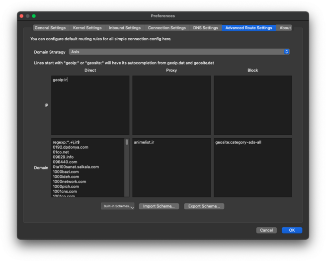
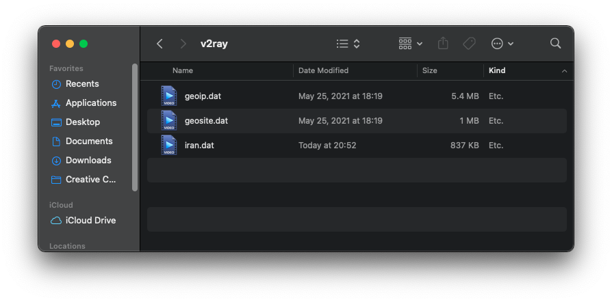

<div dir=rtl>

#  دامنه‌های میزبانی شده در ایران

- [English Document](README.md)

> 🚨 برای دلایل امنیتی، بهتر است از یک اکانت جداگانه و غیرشخصی برای فعالیت‌های GitHubتان استفاده کنید.
>
> 🚨 قبل از push کردن به GitHub تغییراتتان مطمئن شوید که ایمیل شخصیتان قابل مشاهده نیست. [اطلاعات بیشتر](https://docs.github.com/en/account-and-profile/setting-up-and-managing-your-personal-account-on-github/managing-email-preferences/blocking-command-line-pushes-that-expose-your-personal-email-address)


بسیاری از سرویس‌ها و دامنه‌های خارج از ایران سانسور و مسدود شده‌اند و باید برای دسترسی به آن‌ها از VPN و Proxy هایی با امنیت بالا استفاده کنیم، جدای از این مسئله دسترسی به بعضی سرویس‌های ایرانی از طریق IP خارجی مسدود شده است. حال برای رد کردن این سرویس ها لیستی از دامنه‌های داخلی را جمع کرده‌ایم تا با اضافه کردن آن‌ به کلاینت‌های مورد استفاده، دیگر نیاز به قطع کردن VPN برای دسترسی به سرویس‌های داخلی نباشد.

## سلب مسئولیت
  این مخزن فهرستی گردآوری شده از منابع عمومی و در دسترس مردم در مورد وب سایت های میزبانی شده در ایران است. این فقط برای مقاصد اطلاعات عمومی در نظر گرفته شده است و برای ارائه راهنمایی در مورد نحوه اتصال یا ایجاد یا مدیریت یک شبکه خصوصی مجازی (VPN) در نظر گرفته **نشده** است. محتوای این مخزن همانطور که هست ارائه شده است و ما هیچ گونه اظهارنظر یا ضمانتی، صریح یا ضمنی، در مورد کامل بودن، دقت، قابلیت اطمینان، مناسب بودن یا در دسترس بودن اطلاعات موجود در این مخزن نداریم. هر گونه اتکای شما به چنین اطلاعاتی کاملاً به عهده شماست. ما مسئولیتی در قبال خطاها یا حذفیات در اطلاعات یا هر گونه ضرر، خسارت یا سایر تعهدات ناشی از استفاده از آن نخواهیم داشت. لطفاً قبل از استفاده از هر گونه اطلاعات این مخزن احتیاط کنید و با یک متخصص واجد شرایط مشورت کنید.
  


## روش استفاده

بسته به اینکه از کدام کلاینت استفاده می‌کنید، ممکن است متفاوت باشد.  لیست دامنه‌ها و فایل‌های مربوط را می‌توانید از [این صفحه][link-release] دریافت کنید.  
برای سیستم routing بهتر در کلاینت‌های v2ray شما می‌توانید پارامتر `Domain Resolution Strategy` را به `IPIfNonMatch` تغییر دهید. [اطلاعات بیشتر](https://www.v2ray.com/en/configuration/routing.html) 


### [Qv2ray](https://github.com/Qv2ray/Qv2ray)

شما می‌توانید فایل qv2ray_schema.json را در [این صفحه][link-release] پیدا کنید.
  
1. فایل را دانلود کنید.
2. در بخش `preferences` بر روی `Advanced Route Settings` کلیک کنید.
3. در پایین صفحه، بر روی `import schema...` کلیک کنید.
4. فایل qv2ray_schema.json دانلود شده را انتخاب کنید.
5. در کادر باز شده بر روی yes کلیک کنید.
6. بر روی OK کلیک کنید.

<table>
  <tr>
    <td>  </td>
  </tr>
</table>

### .dat file

این فایل در تمامی کلاینت‌های v2ray
  v2fly و xray قابل استفاده است.

1. فایل `iran.dat` را از [این صفحه][link-release] دانلود کنید.
2. فایل را در کلاینت خود کپی و یا وارد کنید.  
  به عنوان مثال:
    - v2ray macOS: `/usr/local/share/v2ray`  
3. قوانین مناسب را اضافه کنید:
    - `ext:iran.dat:ir` در بخش bypass
    - `ext:iran.dat:other` در بخش bypass
    - `ext:iran.dat:ads` در بخش block
4. اتصال خود را قطع و وصل کنید.

<table>
  <tr>
    <td>  </td>
  </tr>
</table>
  
### [SagerNet](https://github.com/SagerNet/SagerNet)

1. فایل `iran.dat` را از [این صفحه][link-release] دانلود کنید.
2. فایل را از طریق `Route -> Three dots -> Manage Route Assets`  به کلاینت اضافه کنید.  
3.  از بخش  `Route -> Create Route` قوانین زیر را اضافه کنید:   
</div>  

- Block Ads:
  - domain: `geosite:category-ads-all`
  - outbound: `Block`
- Block Iran Ads:
  - domain: `ext:iran.dat:ads`
  - outbound: `Block`
- Bypass Iran .ir Domains:
  - domain: `regexp:.+\.ir$`
  - outbound: `Bypass`
- Bypass Iran non .ir Domains:
  - domain: `ext:iran.dat:other`
  - outbound: `Bypass`
- Bypass Iran geoip:
  - ip: `geoip:ir`
  - outbound: `Bypass`

<div dir=rtl>  

> برای مشاهده‌ی اسکرین شات از قوانین بالا [اینجا کلیک کنید](https://imgur.com/a/SEq1Bvg).

4. اتصال خود را قطع و وصل کنید.  

<table>
  <tr>
    <td>  </td>
  </tr>
</table>

### [Shadowrocket](https://apps.apple.com/us/app/shadowrocket/id932747118)

1. فایل `shadowrocket.conf` را دانلود کنید.
2. در اپلیکیشن بر روی `Import From Cloud` کلیک کرده و فایل مربوط را اضافه کنید.
3. در نهایت، بر روی `shadowrocket.conf`کلیک کرده و `Use Config` را انتخاب کنید.

<table>
  <tr>
    <td>   </td>
    <td>   </td>
   </tr>
  </tr>
</table>

### [Clash](https://github.com/Dreamacro/clash) (Like [ClashX](https://github.com/yichengchen/clashX) / [clash_for_windows_pkg](https://github.com/Fndroid/clash_for_windows_pkg) / [Clash .NET](https://github.com/ClashDotNetFramework/ClashDotNetFramework/releases) / ...)

1. صفحه‌ی پروفایل/تنظیمات فعلی خود را که استفاده می‌کنید باز کنید.  
2. این خطوط را به فایل اضافه کنید:  
```yaml
rule-providers:
  iran:
    type: http
    behavior: classical
    url: "https://github.com/bootmortis/iran-hosted-domains/releases/latest/download/clash_rules.yaml"
    path: ./ruleset/iran.yaml
    interval: 432000
```

3. سپس خط زیر را به بخش قوانین `Rules` اضافه کنید:  
```yaml
  - RULE-SET,iran,DIRECT
```

4. فایل را ذخیره کنید.  
5. بستگی به نوع کلاینت، ممکن است لازم باشد نرم‌افزار را روی حالت `Rule‍` تنظیم کنید.  

   
### [V2rayNG](https://github.com/2dust/v2rayNG)

1. ابتدا فایل `iran.dat` را از [این صفحه][link-release] دانلود کنید و در گوشی خود با اپ مدیریت فایل به مسیر `Android/data/com.v2ray.ang/files/assets` منتقل کنید.
2. بعد توی `Setting` برنامه تو بخش `Routing` مطمئن بشید که `Domain Strategy` رو حالت `IpIfNonMatch` باشه:  
3. رو `Custom rules` تپ کنید. تو سربرگ `Direct URL or IP` بنویسید:
- `ext:iran.dat:ir`
- `ext:iran.dat:other`
  
4. تو سربرگ `Blocked URL or IP` بنویسید:
- `ext:iran.dat:ads`
    
بعد هم اوکی کنید و تمام.
<table>
  <tr>
    <td>   </td>
    <td>   </td>
   </tr>
  </tr>
</table>

  
### [V2Ray Server](https://www.v2ray.com/en/configuration/routing.html)
برای مسدود سازی دامنه‌ها و IP های داخلی در سمت سرور لطفا به [این آموزش][link-v2ray-server-block] مراجعه کنید.

  
### [Nekoray](https://github.com/MatsuriDayo/nekoray)

1. در ابتدا فایل `domains.txt` را  از [بخش رلیز][link-release] دانلود کنید.
2. سپس nekoray را باز کنید و روی آیکون `program` بالا سمت چپ کلیک کنید
3. سپس به ترتیب روی دکمه `preferences` و `routing setting`  کلیک کنید
4. فایل دانلود شده را بر روی قسمت Direct-Domain جایگذاری کنید.
5. سپس بر روی OK کلیک کنید و برنامه را دوباره اجرا کنید.

<table>
  <tr>
    <td>  </td>
    <td>  </td>
   </tr>
  </tr>
</table>

  
## [v2rayN](https://github.com/2dust/v2rayN)

1. ابتدا فایل `iran.dat` را از [این صفحه][link-release] دانلود کنید و در محل نصب برنامه `v2rayN` در پوشه `bin` قرار دهید.
2. سپس `v2rayN` را باز کنید و روی `Setting` کلیک کنید و گزینه `RoutingSetting` را انتخاب کنید.
3. سپس در پنجره جدید روِی `Advance Function` کلیک کنید و گزینه `Add` را انتخاب کنید.
4. در پنجره جدید در قسمت `Remarks` یک نام انتخاب کنید و در قسمت `Rule List` در قسمت خالی راست کلیک کرده و گزینه `Rule Add` را انتخاب کنید.
5. در پنجره جدید در قسمت `OutboundTag` گزینه `Direct` را انتخاب کنید و سپس در قسمت `Domains` عبارت `ext:iran.dat:ir,ext:iran.dat:other,regexp:^.+\.ir$` را کپی کنید.
6. بر روی گزینه `Confirm` کلیک کنید تا به صفحه اصلی برنامه برگردید.
7. مطمن شوید که از پایین برنامه فسمت `Routing` نام rule انتخابی شما وارد شده است. درغیر اینصورت فلش رو به پایین سمت راست آنرا بزنید و نام rule انتخابی خود را انتخاب کنید.

## ایجاد دستی فایل .dat (آموزش)

### ۱. نصب [golang](https://go.dev/doc/install)

نصب کردن نسخه درست مهم است، همیشه آن را از [v2fly/domain-list-community](https://github.com/v2fly/domain-list-community/blob/master/go.mod) بررسی کنید.

### ۲. ایجاد Clone از [v2fly/domain-list-community](https://github.com/v2fly/domain-list-community)

```bash
git clone https://github.com/v2fly/domain-list-community
```
### ۳. آماده‌سازی دامنه‌ها

شما می‌توانید در یک فایل .dat هر چقدر که می‌خواهید گروه‌های متفاوت داشته باشید. هر کدام از این گروه‌ها می‌توانند در بخش bypass، proxy یا blocked باشند و هر چقدر که می‌خواهید دامنه داشته باشند.

هر گروه یک فایل txt است که دامنه‌ها را شامل می‌شود. برای مثال، شما می‌توانید یک فایل ads.txt داشته باشید که شامل دامنه‌های تبلیغاتی می‌شود.

### ۴. انتقال فایل‌ها به /data

شما وقتی `domain-list-community‍` را Clone می‌کنید، هر چیزی که از قبل آن‌جا بود را هم Clone می‌کنید. از آنجایی که به آنها نیازی ندارید هر چیزی که در پوشه data است را پاک کنید.

حالا شما باید فایل‌های خودتان را به پوشه data کپی کنید. مطمئن شوید که پسوند آن‌ها را حذف می‌کنید. برای مثال فایل `ads.txt` باید بشود `ads‍`.

```bash
cd domain-list-community
rm data/*

cp ~/ads.txt data/ads
```
### ۵. اجرای برنامه

```bash
go run ./ --outputdir=../
```
## فایل‌ها

- **iran.dat:** شامل تمام سایت های هاست شده در ایران و دامنه های تبلیغاتی با فرمت خاص.
- **domains.txt:** شامل تمام سایت های هاست شده در ایران.
- **qv2ray_schema.json:** فایل قابل استفاده در کلاینت [Qv2ray](https://github.com/Qv2ray/Qv2ray).
- **shadowrocket.conf:** فایل قابل استفاده در کلاینت [Shadowrocket](https://apps.apple.com/us/app/shadowrocket/id932747118).

## منابع و گرامیداشت

- دامنه‌های ایران:
  - [سازمان فناوری اطلاعات ایران](https://g2b.ito.gov.ir/index.php/site/list_ip)
  - [سامانه مدیریت اینترنت مشتریان شرکت مخابرات ایران](https://adsl.tci.ir/panel/sites)
  - مخزن [V2fly Domain List Community](https://github.com/v2fly/domain-list-community) (لایسنس MIT)
  - [لیست شخصی][link-custom]
- تبلیغات:
  - مخزن [uBOPa - uBO Parsi filter list](https://github.com/nimasaj/uBOPa) (لایسنس MIT)

اگر شما منابع دیگری می‌شناسید، و یا وب‌سایتی پیدا کرده‌اید که اینجا نیست لطفا یک
[issue][link-issues] باز کنید و یا فایل [custom_domains.py][link-custom] را تغییر داده و [PR][link-pr] ایجاد کنید.

## چگونه کار می کند؟

به وسیله‌ی Github Action یک اسکریپت پایتون اجرا شده و از طریق منابع بالا فایل‌های مربوطه در صفحه‌ی رلیز ایجاد می‌شود.

</div>  


[link-custom]: src/data/custom_domains.py
[link-pr]: ../../pulls
[link-issues]: ../../issues/new?assignees=&labels=enhancement&template=request-for-domain-addition-removal.md&title=Add%2FRemove+%60example.com%60
[link-release]: ../../releases
[link-v2ray-server-block]: https://github.com/iranxray/hope/blob/main/routing.md#%D9%85%D8%B3%D8%AF%D9%88%D8%AF%D8%B3%D8%A7%D8%B2%DB%8C-%D8%A7%D8%B2-%D8%B3%D9%85%D8%AA-%D8%B3%D8%B1%D9%88%D8%B1
