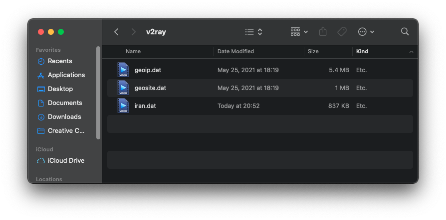
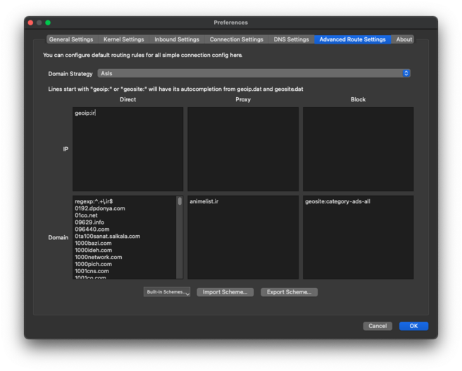
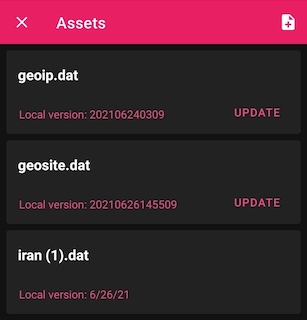
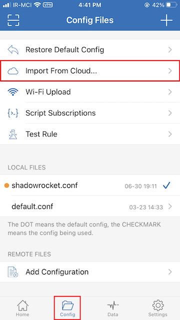
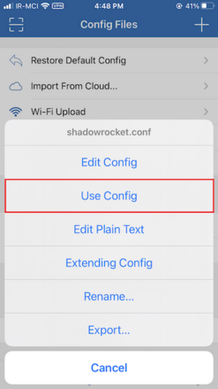
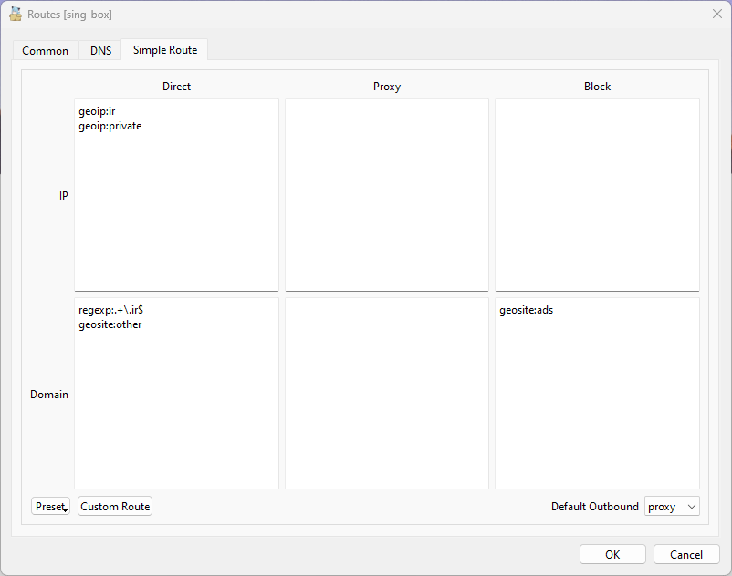
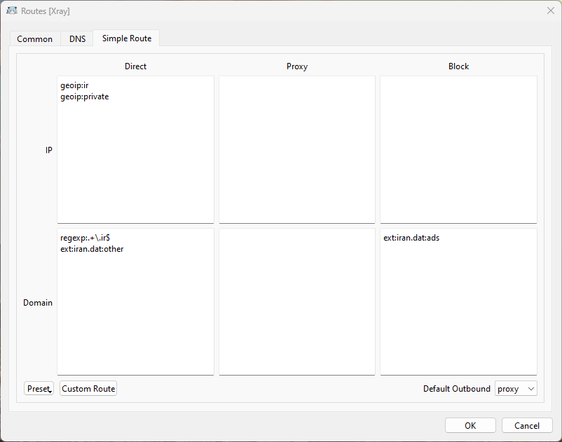

# Iran Hosted Domains

- [داکیومنت فارسی](README.fa.md)

> **Note**
>
> 🚨 For safety reasons, it may be advisable to use a separate, non-personal account for your Github activity.
>
> 🚨 Ensure that your personal email address is not visible when you push commits to Github. [More info](https://docs.github.com/en/account-and-profile/setting-up-and-managing-your-personal-account-on-github/managing-email-preferences/blocking-command-line-pushes-that-expose-your-personal-email-address)

A lot of services and domains are outside of Iran and they are restricted or blocked,
for accessing this service you need to use VPN or proxies with tunneling option, apart from these problems, when we use
proxies the domestic services are unavailable because our IP is not in Iran; for bypassing these issues we gathered a list of
Iranian domains and services to help our people bypass this situation.

## Disclaimer
This repository is a compiled list of public information about websites hosted in Iran. It is intended for informational purposes only and is not intended to provide guidance on how to connect to or create or manage a virtual private network (VPN). The content in this repository is provided as-is and we make no representations or warranties of any kind, express or implied, about the completeness, accuracy, reliability, suitability or availability of the information contained in this repository. Any reliance you place on such information is strictly at your own risk. We will not be liable for any errors or omissions in the information or for any losses, damages, or other liabilities that may arise from its use. Please use caution and consult with a qualified professional before using any information from this repository.


## Usage

This can differ depending on which tool you use. You can download the domains list from the [release page][link-release].  
for quick review of all release files see [Files section](#files).  
In v2ray clients you can set Domain Resolution Strategy to `IPIfNonMatch` for better routing.
[more info.](https://www.v2ray.com/en/configuration/routing.html)

### `iran.dat`/`iran-geosite.db` general rules

`iran.dat` can be used in v2fly, v2ray, and xray clients. Similarly, cores related to SingBox can use the `iran-geosite.db` file.

1. Download `iran.dat` file from [here][link-release].
2. Copy/Import the file to your client.
  For example:
    - v2ray macOS: `/usr/local/share/v2ray`

3. Add proper rules:
    - `ext:iran.dat:all` in bypass section
    - `ext:iran.dat:ads` in block section

4. Reconnect.

#### Full categories

- `ir`: handpicked `.ir` domains, use as `direct`.
- `other`: non `.ir` domains, use as `direct`.
- `tld-ir`: all `.ir` domains, use as `direct`.
- `all`: a combination of `other` and `tld-ir`, should be used as `direct`.
- `ads`: Iran-related advertising services that need to be `blocked`.
- `proxy`: Iran-related domains that are blocked inside of iran and need to be `proxied`.

<table>
  <tr>
    <td>  </td>
  </tr>
</table>

### [Qv2ray](https://github.com/Qv2ray/Qv2ray)

In the release section, you'll find the qv2ray_schema file.

1. Download the file.
2. open `preferences` and click on `Advanced Route Settings`.
3. From the bottom of the screen, click on `import schema...`.
4. choose the downloaded file (qv2ray_schema.json).
5. in the opened dialogue box, click on yes.
6. Click on OK.

<table>
  <tr>
    <td></td>
  </tr>
</table>

### [SagerNet](https://github.com/SagerNet/SagerNet) / [Matsuri](https://github.com/MatsuriDayo/Matsuri)

1. Download `iran.dat` file from [here][link-release].
2. Import .dat file from `Route -> Three dots -> Manage Route Assets`:

3.  Add proper rules  `Route -> Create Route`:
    - Block Ads:
      - domain: `geosite:category-ads-all`
      - outbound: `Block`
    - Block Iran Ads:
      - domain: `ext:iran.dat:ads`
      - outbound: `Block`
    - Bypass Iran Domains:
      - domain: `ext:iran.dat:all`
      - outbound: `Bypass`
    - Bypass Iran geoip:
      - ip: `geoip:ir`
      - outbound: `Bypass`
> for screenshots of routing settings [click here](https://imgur.com/a/SEq1Bvg).

4. Reconnect.

<table>
  <tr>
    <td>  </td>
  </tr>
</table>


### [NekoBox](https://github.com/MatsuriDayo/NekoBoxForAndroid)

1. Download `iran-geosite.db` file from [here][link-release].
2. Rename it to `geosite.db`
3. Import .db file from `Route -> Three dots -> Manage Route Assets`:
4.  Add proper rules  `Route -> Create Route`:
    - Block Iran Ads:
      - domain: `geosite:ads`
      - outbound: `Block`
    - Bypass Iran Domains:
      - domain: `geosite:all`
      - outbound: `Bypass`
    - Bypass Iran geoip:
      - ip: `geoip:ir`
      - outbound: `Bypass`
5. Reconnect.

⚠️ Important: You are replacing default geosite with `iran-geosite.db` by doing this, so you can't use default geosite categories like `category-ads-all`. You can switch back to default geosite by updating `geosite.db` from `Manage Route Assets` section.


### [Shadowrocket](https://apps.apple.com/us/app/shadowrocket/id932747118)


1. Download `shadowrocket.conf` file.
2. Tap `Import From Cloud` in the Shadowrocket app and then import the file.
3. Finally, tap on the `shadowrocket.conf` and select `Use Config`.

<table>
  <tr>
    <td>   </td>
    <td>   </td>
  </tr>
</table>


### [Clash](https://github.com/Dreamacro/clash) (Like [ClashX](https://github.com/yichengchen/clashX) / [clash_for_windows_pkg](https://github.com/Fndroid/clash_for_windows_pkg) / [Clash Verge](https://github.com/zzzgydi/clash-verge) / ...)

1. Make sure you are using at least version `2023.04.13` of [Clash Premium](https://github.com/Dreamacro/clash/releases/tag/premium) Core  Or `v1.14.4` of [Clash.Meta](https://github.com/MetaCubeX/Clash.Meta) Core. If not, you can use the old version format described in the third step.
2. Open your current profile/config that you use.
3. Add these lines to the file:
```yaml
rule-providers:
  iran_other:
    type: http
    format: text
    behavior: domain
    url: "https://github.com/bootmortis/iran-hosted-domains/releases/latest/download/clash_rules_other.txt"
    path: ./ruleset/iran_other.txt
    interval: 432000
  iran_ads:
    type: http
    format: text
    behavior: domain
    url: "https://github.com/bootmortis/iran-hosted-domains/releases/latest/download/clash_rules_ads.txt"
    path: ./ruleset/iran_ads.txt
    interval: 432000
```
⚠️ Note: If you are using older versions add these instead :
```yaml
rule-providers:
  iran_other:
    type: http
    behavior: domain
    url: "https://github.com/bootmortis/iran-hosted-domains/releases/latest/download/clash_rules_other.yaml"
    path: ./ruleset/iran_other.yaml
    interval: 432000
  iran_ads:
    type: http
    behavior: domain
    url: "https://github.com/bootmortis/iran-hosted-domains/releases/latest/download/clash_rules_ads.yaml"
    path: ./ruleset/iran_ads.yaml
    interval: 432000
```

4. Add these lines to `rules:` section
```yaml
  - RULE-SET,iran_ads,REJECT
  - DOMAIN-SUFFIX,ir,DIRECT
  - RULE-SET,iran_other,DIRECT
  - GEOIP,IR,DIRECT
```
5. Save the file.
6. Based on the client, you may need to set clash on `Rule` mode.


### [Surge](https://nssurge.com) / [Surfboard](https://getsurfboard.com)
1. Open your current profile/config that you use.
2. Add these lines to `[Rule]` section
```INI
DOMAIN-SET,https://github.com/bootmortis/iran-hosted-domains/releases/latest/download/surge_domainset_ads.txt,REJECT,update-interval=432000
DOMAIN-SUFFIX,ir,DIRECT
DOMAIN-SET,https://github.com/bootmortis/iran-hosted-domains/releases/latest/download/surge_domainset_other.txt,DIRECT,update-interval=432000
GEOIP,IR,DIRECT
```
> Surfboard ignore update-interval at this moment, consider updating from Tool>External resources

⚠️ Note: If you are using older Surge versions (before Surge for Mac v3.5.1/Surge for iOS v4.2.2) add these instead:
```INI
RULE-SET,https://github.com/bootmortis/iran-hosted-domains/releases/latest/download/surge_ruleset_ads.txt,REJECT,update-interval=432000
DOMAIN-SUFFIX,ir,DIRECT
RULE-SET,https://github.com/bootmortis/iran-hosted-domains/releases/latest/download/surge_ruleset_other.txt,DIRECT,update-interval=432000
GEOIP,IR,DIRECT
```
3. Save the file.
4. Set 'Outbound Mode' to 'Rule-based'.

⚠️ Note : in case that blocked websites are not working with 'Rule-based' mode, consider adding this rule before 'FINAL' rule:
```INI
DOMAIN-KEYWORD,,YourFinalProxy/ProxyGroup,force-remote-dns
```
> Use your own Proxy/ProxyGroup instead of 'YourFinalProxy/ProxyGroup'

🚨 You can also use Surge's Rule-Set or Domain-Set in [Loon](https://www.nsloon.com) / [LanceX](https://lancex.org).

### [v2rayNG](https://github.com/2dust/v2rayNG)

📽️ [Video tutorial](https://imgur.com/8qS5ILD)  

1. First download `iran.dat` from [here][link-release].  
2. From the menu, go to the `Geo asset files` section, press `+` from the top, and select the `iran.dat` file.  
2. From the menu, go to `Settings` and make sure `Domain Strategy` is set to `IpIfNonMatch`.  
3. Go to the `Custom rules` section in `Settings`.  
  - In the `DIRECT URL OR IP` tab, write `ext:iran.dat:all,geoip:ir`, then press `🗸` from the top.  
  - In the `BLOCKED URL OR IP` tab, write `ext:iran.dat:ads` and then press `🗸` from the top again.  
4. Hit back, and that's it.  

### [V2Ray Server](https://www.v2ray.com/en/configuration/routing.html)
For blocking local domains and IPs in the server side follow [this][link-v2ray-server-block] instructions (also be sure to check [#58](/../../issues/58) too).

### [Nekoray](https://github.com/MatsuriDayo/nekoray)

:warning: Nekoray can use both sing-box and Xray cores. Please use the corresponding routing rules according to your selected Nekoray core.

:information_source: You can see your current Nekoray core by going to `preferences` > `Basic Settings` > `Core`. 

  - #### [sing-box core](#sing-box-core)

  1. Download `iran-geosite.db` from [release section][link-release].
  2. Rename it to `geosite.db`.
  3. Rename `geosite.db` in Nekoray folder to `backup-geosite.db`.
  4. Copy the downloaded `geosite.db` to Nekoray folder.
  5. Open `preferences` and click on `Routing Setting`.
  6. Go to `Simple Route` tab.
  7. Copy the following lines to the corresponding fields:
   - `Direct, IP`
   ```
   geoip:ir
   geoip:private
   ```
   - `Direct, Domain`
   ```
   geosite:all
   ```
   - `Block, Domain`
   ```
   geosite:ads
   ```
  8. Press OK button and restart the app.
  
  :warning: Important: By changing the default `geosite.db`, you can't use default geosite categories like `category-ads-all`. You can switch back to default geosite by removing the new `geosite.db` and renaming `backup-geosite.db` back to `geosite.db`. You can also download the original `geosite.db` from [sing-geosite](https://github.com/SagerNet/sing-geosite/releases).
  
  <table>
   <tr>
    <td>  </td>
   </tr>
  </table>

  - #### [Xray core](#Xray-core)

  1. Download `iran.dat` from [release section][link-release].
  2. Copy `iran.dat` to Nekoray folder.
  3. Open `preferences` and click on `Routing Setting`.
  4. Go to `Simple Route` tab.
  5. Copy the following lines to the corresponding fields:
   - `Direct, IP`
   ```
   geoip:ir
   geoip:private
   ```
   - `Direct, Domain`
   ```
   ext:iran.dat:all
   ```
   - `Block, Domain`
   ```
   ext:iran.dat:ads
   ```
   6. Press OK button and restart the app.

   <table>
    <tr>
     <td>  </td>
    </tr>
   </table>

### [v2rayN](https://github.com/2dust/v2rayN/)

1. Download `iran.dat` file from [here][link-release] and place in v2rayN directory and inside `bin` folder.
2. Open v2ray and select `Settings` and then select `RoutingSetting`
3. In the new window click on `Advanced Function` and choose `Add`
4. In the new window, in `Remarks` field choose any name and in the `Rule List` empty area right-click and select `Rule Add`
5. In the new window choose `direct` for `outboundTag` and the domain section type `ext:iran.dat:all`
6. Click on `Confirm` until you reach the main app window
7. Make sure that your rule is selected from the bottom of the page. If not choose it from the drop down menu.


### [SwitchyOmega](https://github.com/FelisCatus/SwitchyOmega)
1. Open SwitchyOmega Options.
2. Go to `auto switch` Or any other Switch type profile that you use.
3. Check `Rule list rules` box and choose Direct for it's profile.
4. Choose your proxy's profile for `Default` rule.
5. Use `Switchy` for `Rule List Format`.
6. Enter this URL for `Rule List URL`:
 ```
 https://github.com/bootmortis/iran-hosted-domains/releases/latest/download/switchy_omega.sorl
 ```
7. Tap `Download Profile Now`.
8. Apply Changes.
9. Set SwitchyOmegas's mode to `auto switch` or your other Switch type profile that you use.
>  For updating rules's list just repeat step 7.


### [Sing-Box](https://github.com/SagerNet/sing-box)

1. Download `iran-geosite.db` file from [here][link-release] and place it in the sing-box working directory.
2. Open the sing-box config file and edit the Route section in this [format](https://sing-box.sagernet.org/configuration/route/geosite/)

```json
{
  "route": {
    "geosite": {
      "path": "iran-geosite.db",
      "download_url": "https://github.com/bootmortis/iran-hosted-domains/releases/latest/download/iran-geosite.db"
    },
    "rules": [
      {
        "geosite": "all",
        "outbound": "direct"
      },
      {
        "geosite": "ads",
        "outbound": "block"
      },
      {
        "domain_suffix": [
          ".ir"
        ],
        "outbound": "direct"
      }
    ]
  }
}
```
3. For more information about the sing-box config template [see here](https://sing-box.sagernet.org/configuration/).

### [Hysteria](https://github.com/apernet/hysteria)
1. Download `hysteria_client.acl` OR `hysteria_server.acl` based on your usage from [here][link-release].
    - hysteria_client.acl : block Iran ADs and bypass other Iran Domains/IPs (for client)
    - hysteria_server.acl : block all Iran Domains/IPs (for server)
    
2. Add these lines to your conifg:
```json
    "acl": "acl_file_path",
    "mmdb": "GeoLite2-Country.mmdb"
```
> 'acl_file_path': path of downloaded `.acl` file

### [OpenWrt Pass Wall](https://github.com/xiaorouji/openwrt-passwall)
Only tested with Xray core. (v2ray core may work too)
1. Download `iran.dat` file from [here][link-release].
  ```shell
  curl -LO https://github.com/bootmortis/iran-hosted-domains/releases/latest/download/iran.dat
  ```
2. Move `iran.dat` to `/usr/share/v2ray/` directory. (you can see the correct directory in `Pass Wall -> Rule Manage -> Location of V2ray/Xray asset`)
  ```shell
  mv iran.dat /usr/share/v2ray/
  ```
3. Create these new Shunt Rules in `Pass Wall -> Rule Manage -> Shunt Rules` in this order:
   1. `Block`:
      - Remarks: `Block`
      - Domain: `ext:iran.dat:ads`
   2. `Proxy`:
      - Remarks: `Proxy`
      - Domain: `ext:iran.dat:proxy`
   3. `Direct`:
      - Remarks: `Direct`
      - Domain: `ext:iran.dat:all` (you can use `other`, `ir` or `tld-ir` instead of `all` if you want. For more info see [Full categories](#full-categories))
      - IP: `geoip:ir` (you can also add `geoip:private` too in a new line)
4. Create new node in `Pass Wall -> Node List -> Add`:
   - Node Remarks: `Shunt`
   - Type: `Xray`
   - Protocol: `Shunt`
   - Block: `Blackhole`
   - Proxy: `Default`
   - Direct: `Direct Connection`
   - Default: One of your other nodes
   - Domain Strategy: `AsIs` for better performance or `IPIfNonMatch` for better routing.
5. Go to `Pass Wall -> Basic Settings -> Main` then:
   - TCP Node: `[Shunt]`
   - UDP Node: `Same as the tcp node`
   - Hit `Save & Apply`
   - You can also go to `DNS` tab and hit `Clear IPSET`.
   
## Automatically Updating the `iran.dat` File

Ensuring that you have the latest version of the `iran.dat` file is crucial for accurate filtering of Iranian domains. This section will guide you on how to set up an automated process to update the file on a regular basis.

### Linux

#### Prerequisites

- You should have `curl` and `shasum` installed on your system.

#### Usage

1. Download the [update_iran_dat.sh](scripts/update_iran_dat.sh) script from this repository.
    ```shell
    curl -LO https://raw.githubusercontent.com/bootmortis/iran-hosted-domains/main/scripts/update_iran_dat.sh
    ```
2. Make the script executable by running the following command in the terminal:
    ```shell
    chmod +x update_iran_dat.sh
    ```
3. Open your crontab file by running the following command:
    ```shell
    crontab -e
    ```
4. In the crontab editor, add the following line to schedule the script to run every Tuesday (a day after we update `iran.dat`):
    ```shell
    0 0 * * 2 /path/to/update_iran_dat.sh /path/to/iran.dat
    ```
    Make sure to replace `/path/to/update_iran_dat.sh` with the actual path to the script on your system and `/path/to/iran.dat` with the actual path to the `iran.dat` file that you want to update.
5. Save the crontab file and exit the editor.

### Windows

#### Prerequisites

- Since the script is not signed, you must have the appropriate execution policy to run it.
- This can be achieved by running the following command in a Powershell window with administrative rights:
    ```powershell
    Set-ExecutionPolicy unrestricted
    ```

#### Usage

1. Download the [update_iran_dat.ps1](scripts/update_iran_dat.ps1) script from this repository and move it to your preferred  location (next to `iran.dat` file should be good).

2. Run the Windows command prompt as Administrator and execute the following command:
   ```cmd
   SCHTASKS /CREATE /SC WEEKLY /D TUE /TN "UPDATE IRAN.DAT" /TR "powershell -File '<path\to\update_iran_dat.ps1>' '<path\to\iran.dat>'" /ST 19:00
   ```

    Make sure to replace `<path\to\update_iran_dat.ps1>` with the actual path to the script on your system and `<path\to\iran.dat>` with the actual path to the `iran.dat` file that you want to update. 

The scripts handle the process of updating the `iran.dat` file. They check if the file already exists and compare the checksum of the existing file with the latest version available on the repository. If a new version is available, they download the updated file and replace the existing one. If the local file doesn't exist, they simply download the latest version and save it to the specified path.

**Note:** The script assumes that you have the necessary permissions to write to the directory where the `iran.dat` file is located. If you encounter any issues, ensure that the script has appropriate write permissions or modify the script accordingly.

It is recommended to test the script manually before setting up the cron job or SCHTASK to ensure it executes correctly.


## Create .dat file manually (Tutorial)

### 1. Install [golang](https://go.dev/doc/install)

It's important to install the right version. Always check it from [v2fly/domain-list-community](https://github.com/v2fly/domain-list-community/blob/master/go.mod).

### 2. Clone [v2fly/domain-list-community](https://github.com/v2fly/domain-list-community)

```
git clone https://github.com/v2fly/domain-list-community
```

### 3. Prepare domains

In a .dat file, you can have as many distinct groups as you want. Each of these groups can be in bypass, proxy or blocked sections. Each group can have as many domains as you want.

Each group is a txt file containing domains. For example, you can have an ads.txt file containing ad domains.

### 4. Move files to /data

When cloning `domain-list-community`, you also clone all the groups that have been there before. Since you don't need them, delete everything in /data directory.

Now you have to copy your files to /data directory. Make sure to remove their file extension. So for example, `ads.txt` needs to be `ads`.

```
cd domain-list-community
rm data/*

cp ~/ads.txt data/ads
```

### 5. Run the program

```
go run ./ --outputdir=../
```

## Files
You can always find the latest version of these files in the [release page][link-release].  
You can click on app name to see the usage instructions.  
Also, for each file there is a `.sha256` file that contains sha256 hash of that file.  
- **clash_rules_ads.txt**, **clash_rules_ads.yaml**, **clash_rules_other.txt** and **clash_rules_other.yaml**: Contains all ADs and non-ir domains for [clash](#clash-like-clashx--clash_for_windows_pkg--clash-verge) in two different formats.
- **domains.txt**: Contains all websites hosted in Iran.
- **hysteria_client.acl** and **hysteria_server.acl**: see [Hysteria](#hysteria) section.
- **iran-geosite.db**: for sing-box core see [Sing-Box](#sing-box) section.
- **iran.dat**: Contains all websites hosted in Iran, ADs and proxy related domains for v2ray/xray, see [Full Categories](#full-categories) for more info.
- **qv2ray_schema.json**: Importable json schema that can be used in [Qv2ray](#qv2ray).
- **shadowrocket.conf:** Importable conf file that can be used in [Shadowrocket](#shadowrocket).
- **surge_domainset_ads.txt**, **surge_domainset_other.txt**, **surge_ruleset_ads.txt** and **surge_ruleset_other.txt**: Contains all ADs and non-ir websites hosted in Iran for [Surge](#surge--surfboard) in two different formats.
- **switchy_omega.sorl**: Contains domains for [SwitchyOmega](#switchyomega).

## Sources & Acknowledgements

- Iran Domains:
  - [ITO GOV](https://eservices.ito.gov.ir/page/iplist) - [Mirror](https://github.com/bootmortis/ito-gov-mirror)
  - [Enamad](https://enamad.ir/DomainListForMIMT) - [Mirror](https://github.com/bootmortis/enamad-mirror)
  - [ADSL TCI](https://adsl.tci.ir/panel/sites)
  - [V2fly Domain List Community](https://github.com/v2fly/domain-list-community) (MIT License)
  - [Iran Web and Mobile Festival](https://directory.iwmf.ir/) - [Mirror](https://github.com/Chocolate4U/iwmf.ir-Mirror) (MIT License)
  - [Custom List][link-custom]
- ADs:
  - [uBOPa - uBO Parsi filter list](https://github.com/nimasaj/uBOPa) (MIT License)

If you know of any other source, or you found a website that isn't here, please open
an [issue][link-issues] or add that specific website to [custom_domains.py][link-custom] and make a [PR][link-pr].

## How does it work?

A Python script is executed by Github Action and generates files that are on the release page.

[link-custom]: src/data/custom_domains.py
[link-pr]: ../../pulls
[link-issues]: ../../issues/new?assignees=&labels=enhancement&template=request-for-domain-addition-removal.md&title=Add%2FRemove+%60example.com%60
[link-release]: ../../releases/latest
[link-v2ray-server-block]: https://github.com/iranxray/hope/blob/main/routing.md#%D9%85%D8%B3%D8%AF%D9%88%D8%AF%D8%B3%D8%A7%D8%B2%DB%8C-%D8%A7%D8%B2-%D8%B3%D9%85%D8%AA-%D8%B3%D8%B1%D9%88%D8%B1
