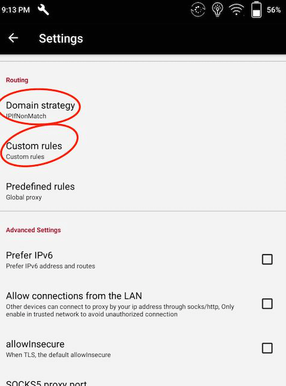
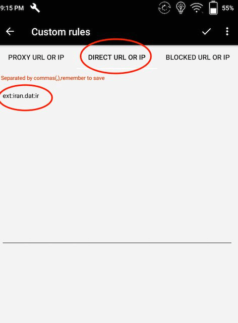
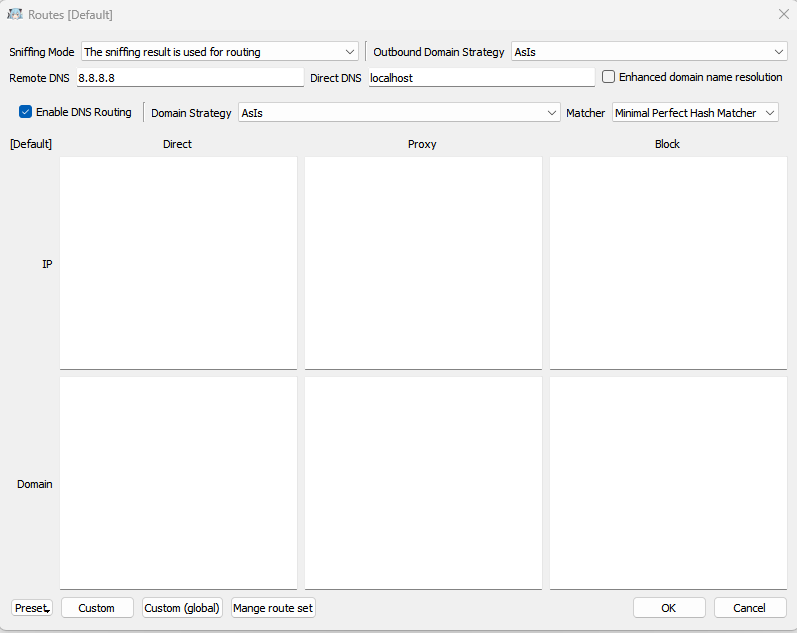
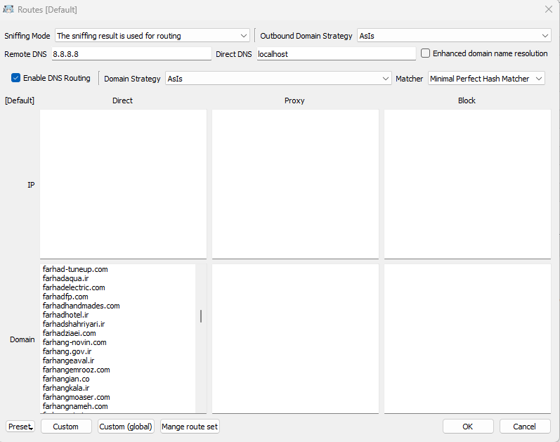

# Iran Hosted Domains

- [داکیومنت فارسی](README.fa.md)

> **Note**
>
> 🚨 For safety reasons, it may be advisable to use a separate, non-personal account for your Github activity.
>
> 🚨 Ensure that your personal email address is not visible when you push commits to Github. [More info](https://docs.github.com/en/account-and-profile/setting-up-and-managing-your-personal-account-on-github/managing-email-preferences/blocking-command-line-pushes-that-expose-your-personal-email-address)

A lot of services and domains are outside of Iran and they are restricted or blocked,
for accessing this service you need to use VPN or proxies with tunneling option, apart from these problems, when we use
proxies the domestic services are unavailable because our IP is not in Iran; for bypassing these issues we gathered a list of
Iranian domains and services to help our people bypass this situation.

## Disclaimer
This repository is a compiled list of public information about websites hosted in Iran. It is intended for informational purposes only and is not intended to provide guidance on how to connect to or create or manage a virtual private network (VPN). The content in this repository is provided as-is and we make no representations or warranties of any kind, express or implied, about the completeness, accuracy, reliability, suitability or availability of the information contained in this repository. Any reliance you place on such information is strictly at your own risk. We will not be liable for any errors or omissions in the information or for any losses, damages, or other liabilities that may arise from its use. Please use caution and consult with a qualified professional before using any information from this repository.


## Usage

This can differ depending on which tool you use. You can download the domains list from
the [release page][link-release].
In v2ray clients you can set Domain Resolution Strategy to `IPIfNonMatch` for better routing.
[more info.](https://www.v2ray.com/en/configuration/routing.html)

### [Qv2ray](https://github.com/Qv2ray/Qv2ray)

In the release section, you'll find the qv2ray_schema file.

1. Download the file.
2. open `preferences` and click on `Advanced Route Settings`.
3. From the bottom of the screen, click on `import schema...`.
4. choose the downloaded file (qv2ray_schema.json).
5. in the opened dialogue box, click on yes.
6. Click on OK.

<table>
  <tr>
    <td></td>
  </tr>
</table>

### .dat file

It can be used in all v2fly, v2ray and xray clients.

1. Download `iran.dat` file from [here][link-release].
2. Copy/Import file in your client.
  for example:
    - v2ray macOS: `/usr/local/share/v2ray`

3. Add proper rules:
    - `ext:iran.dat:ir` in bypass section
    - `ext:iran.dat:other` in bypass section
    - `ext:iran.dat:ads` in block section

4. Reconnect.

<table>
  <tr>
    <td>  </td>
  </tr>
</table>

### [SagerNet](https://github.com/SagerNet/SagerNet)

1. Download `iran.dat` file from [here][link-release].
2. Import .dat file from `Route -> Three dots -> Manage Route Assets`:

3.  Add proper rules  `Route -> Create Route`:
    - Block Ads:
      - domain: `geosite:category-ads-all`
      - outbound: `Block`
    - Block Iran Ads:
      - domain: `ext:iran.dat:ads`
      - outbound: `Block`
    - Bypass Iran .ir Domains:
      - domain: `regexp:.+\.ir$`
      - outbound: `Bypass`
    - Bypass Iran non .ir Domains:
      - domain: `ext:iran.dat:other`
      - outbound: `Bypass`
    - Bypass Iran geoip:
      - ip: `geoip:ir`
      - outbound: `Bypass`
> for screenshots of routing settings [click here](https://imgur.com/a/SEq1Bvg).

4. Reconnect.

<table>
  <tr>
    <td>  </td>
  </tr>
</table>

### [Shadowrocket](https://apps.apple.com/us/app/shadowrocket/id932747118)


1. Download `shadowrocket.conf` file.
2. Tap `Import From Cloud` in the Shadowrocket app and then import the file.
3. Finally, tap on the `shadowrocket.conf` and select `Use Config`.

<table>
  <tr>
    <td>   </td>
    <td>   </td>
  </tr>
</table>


### [Clash](https://github.com/Dreamacro/clash) (Like [ClashX](https://github.com/yichengchen/clashX) / [clash_for_windows_pkg](https://github.com/Fndroid/clash_for_windows_pkg) / [Clash .NET](https://github.com/ClashDotNetFramework/ClashDotNetFramework/releases) / ...)

1. Open your current profile/config that you use.
2. Add these lines to the file:
```yaml
rule-providers:
  iran:
    type: http
    behavior: classical
    url: "https://github.com/bootmortis/iran-hosted-domains/releases/latest/download/clash_rules.yaml"
    path: ./ruleset/iran.yaml
    interval: 432000
```

3. Add this line to `rules:` section
```yaml
  - RULE-SET,iran,DIRECT
```
4. Save the file.
5. Based on the client, you may need to set clash on `Rule` mode.

### [V2rayNG](https://github.com/2dust/v2rayNG)

1. First download the file `iran.dat` from [here][link-release] then move it to the address `Android/data/com.v2ray.ang/files/assets` using a File Manager.
2. Then make sure `Routing` is set to `IpIfNonMatch` from `Domain Strategy` in the `Setting`.
3. Tap on the `Direct URL or IP`. Write the following in the `Custom rules` tab:
- `ext:iran.dat:ir`
- `ext:iran.dat:other`
  
4. Write the following in the `Blocked URL or IP` tab:
- `ext:iran.dat:ads`
  
5. Then press OK and that's it.

<table>
  <tr>
    <td>   </td>
    <td>   </td>
   </tr>
  </tr>
</table>

### [V2Ray Server](https://www.v2ray.com/en/configuration/routing.html)
For blocking local domains and IPs in the server side follow [this][link-v2ray-server-block] instructions. It's only available in Persian.

### [Nekoray](https://github.com/MatsuriDayo/nekoray)

1. Download the `domains.txt` file from [release section][link-release].
2. Open `Program` in the man page of nekoray.
3. Open `preferences` and click on `Routing Setting`.
4. Paste `domains.txt` file on domain-direct section.
5. Press OK button and restart the app.

<table>
  <tr>
    <td>  </td>
    <td>  </td>
   </tr>
  </tr>
</table>

### [v2rayN](https://github.com/2dust/v2rayN/)

1. Download `iran.dat` file from [here][link-release] and place in v2rayN directory and inside `bin` folder.
2. Open v2ray and select `Settings` and then select `RoutingSetting`
3. In the new window click on `Advanced Function` and choose `Add`
4. In the new window, in `Remarks` field choose any name and in the `Rule List` empty area right-click and select `Rule Add`
5. In the new window choose `direct` for `outboundTag` and the domain section type `ext:iran.dat:ir,ext:iran.dat:other,regexp:^.+\.ir$`
6. Click on `Confirm` until you reach the main app window
7. Make sure that your rule is selected from the bottom of the page. If not choose it from the drop down menu.

### [Sing-Box](https://github.com/SagerNet/sing-box)

1. Download 'iran-geosite.db' file from [here][link-release] and plafce it in sing-box working directory.
2. Open sing-box config file and edit route section in this [format](https://sing-box.sagernet.org/configuration/route/geosite/)

```
"route": {
        "geosite": {
                "path": "Sing-Box_Working_Directory",
                "download_url": "https://github.com/bootmortis/iran-hosted-domains/releases/latest/download/iran-geosite.db"
        },
        "rules": [{
                        "geosite": "ir",
                        "outbound": "direct"
                },
                {
                        "geosite": "other",
                        "outbound": "direct"
                },
                {
                        "geosite": "ads",
                        "outbound": "block"
                },
                {
                        "domain_suffix": [
                                ".ir"
                        ],
                        "outbound": "direct"
                }]}
```
3. For more information about sing-box config template [link](https://sing-box.sagernet.org/configuration/)

## Create .dat file manually (Tutorial)

### 1. Install [golang](https://go.dev/doc/install)

It's important to install the right version. Always check it from [v2fly/domain-list-community](https://github.com/v2fly/domain-list-community/blob/master/go.mod).

### 2. Clone [v2fly/domain-list-community](https://github.com/v2fly/domain-list-community)

```
git clone https://github.com/v2fly/domain-list-community
```

### 3. Prepare domains

In a .dat file, you can have as many distinct groups as you want. Each of these groups can be in bypass, proxy or blocked sections. Each group can have as many domains as you want.

Each group is a txt file containing domains. For example, you can have an ads.txt file containing ad domains.

### 4. Move files to /data

When cloning `domain-list-community`, you also clone all the groups that have been there before. Since you don't need them, delete everything in /data directory.

Now you have to copy your files to /data directory. Make sure to remove their file extension. So for example, `ads.txt` needs to be `ads`.

```
cd domain-list-community
rm data/*

cp ~/ads.txt data/ads
```

### 5. Run the program

```
go run ./ --outputdir=../
```

## Files

- **iran.dat:** Contains all websites hosted in Iran and ADs in a special format.
- **domains.txt:** Contains all websites hosted in Iran.
- **qv2ray_schema.json:** Importable json schema that can be used in [Qv2ray](https://github.com/Qv2ray/Qv2ray).
- **shadowrocket.conf:** Importable conf file that can be used in [Shadowrocket](https://apps.apple.com/us/app/shadowrocket/id932747118).

## Sources & Acknowledgements

- Iran Domains:
  - [ITO GOV](https://eservices.ito.gov.ir/page/iplist) - [Mirror](https://github.com/bootmortis/ito-gov-mirror)
  - [ADSL TCI](https://adsl.tci.ir/panel/sites)
  - [V2fly Domain List Community](https://github.com/v2fly/domain-list-community) (MIT License)
  - [Custom List][link-custom]
- ADs:
  - [uBOPa - uBO Parsi filter list](https://github.com/nimasaj/uBOPa) (MIT License)

If you know of any other source, or you found a website that isn't here, please open
an [issue][link-issues] or add that specific website to [custom_domains.py][link-custom] and make a [PR][link-pr].

## How does it work?

A Python script is executed by Github Action and generates files that are on the release page.

[link-custom]: src/data/custom_domains.py
[link-pr]: ../../pulls
[link-issues]: ../../issues/new?assignees=&labels=enhancement&template=request-for-domain-addition-removal.md&title=Add%2FRemove+%60example.com%60
[link-release]: ../../releases
[link-v2ray-server-block]: https://github.com/iranxray/hope/blob/main/routing.md#%D9%85%D8%B3%D8%AF%D9%88%D8%AF%D8%B3%D8%A7%D8%B2%DB%8C-%D8%A7%D8%B2-%D8%B3%D9%85%D8%AA-%D8%B3%D8%B1%D9%88%D8%B1
