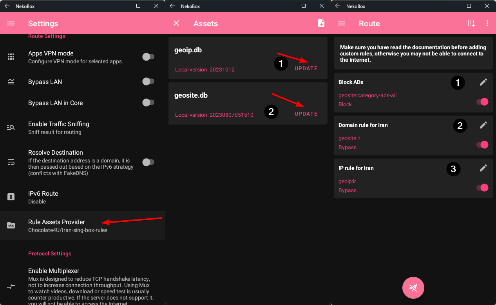

# NekoBox for Android

شما می‌توانید کلاینت NekoBox برای اندروید را [اینجا](https://github.com/MatsuriDayo/NekoBoxForAndroid) پیدا کنید.

### مسیریابی :id=routing

1. به `Settings -> Route Settings` بروید و `Rule Assets Provider` را به [`Chocolate4U/Iran-sing-box-rules`](https://github.com/Chocolate4U/Iran-sing-box-rules) تغییر دهید.
2. به `Route -> Three dots -> Manage Rute Assets` بروید و سپس قوانین را به‌روز کنید.
3. به `Route` برگشته و مطمئن شوید که این قوانین وجود دارند و فعال هستند:

-   Block Ads:
    -   domain: `geosite:category-ads-all`
    -   outbound: `Block`
-   Bypass Iran Domains:
    -   domain: `geosite:ir`
    -   outbound: `Bypass`
-   Bypass Iran geoip:
    -   ip: `geoip:ir`
    -   outbound: `Bypass`

4. مجدداً وصل شوید.

