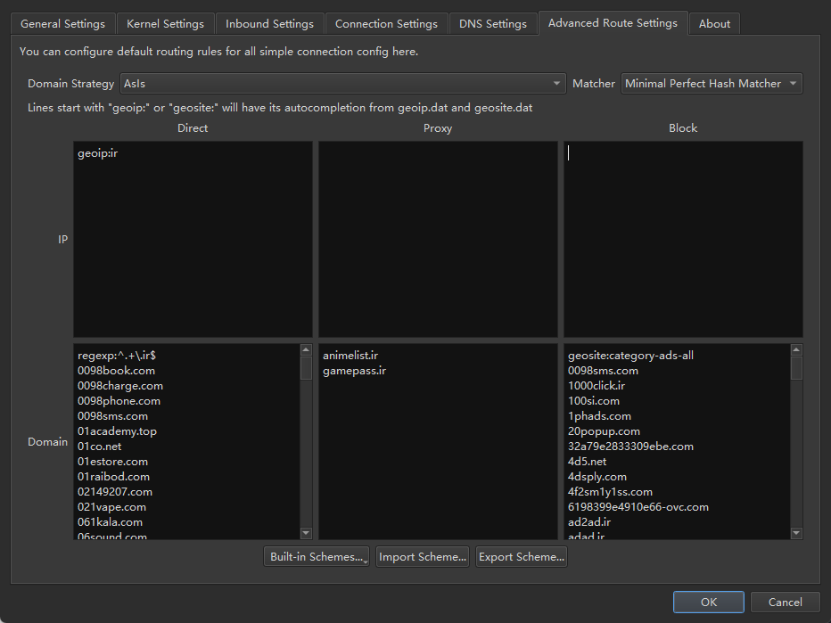

# Qv2ray

## کلاینت :id=client

شما می‌توانید کلاینت‌های لینوکس، ویندوز و مک‌اواس را از [اینجا](https://github.com/Qv2ray/Qv2ray) پیدا کنید.

!> لطفا توجه داشته باشید که Qv2ray از تاریخ ۱۷ اوت ۲۰۲۱ [**دیگر توسط توسعه‌دهنده نگهداری نمی‌شود**](https://github.com/Qv2ray/Qv2ray?tab=readme-ov-file#%E6%9C%AC%E9%A1%B9%E7%9B%AE%E5%B7%B2%E4%B8%8D%E5%86%8D%E7%BB%B4%E6%8A%A4).

## مسیریابی :id=routing

### از طریق فایل scheme :id=using-scheme

1. دانلود آخرین نسخه از [qv2ray_schema.json](https://github.com/bootmortis/iran-hosted-domains/releases/latest/download/qv2ray_schema.json)
2. باز کردن `Preferences` و کلیک بر روی `Advanced Route Settings`.
3. از پایین صفحه، بر روی `Import Schema...` کلیک کنید.
4. فایل دانلود شده `qv2ray_schema.json` را انتخاب کنید.
5. در صفحه باز شده، بر روی بله کلیک کنید.
6. بر روی OK کلیک کنید.

