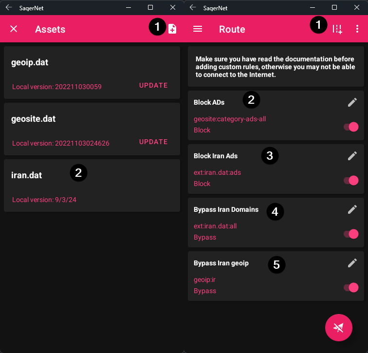

# SagerNet

شما می‌توانید کلاینت SagerNet را از [اینجا](https://github.com/SagerNet/SagerNet) و کلاینت Matsuri را از [اینجا](https://github.com/MatsuriDayo/Matsuri) پیدا کنید.

!> لطفا توجه داشته باشید که هر دو کلاینت SagerNet و Matsuri **دیگر توسط توسعه‌دهندگان نگهداری نمی‌شوند**. توصیه می‌شود که گزینه‌های جایگزین را در نظر بگیرید.

## مسیریابی :id=routing

1. دانلود آخرین نسخه [iran.dat](https://github.com/bootmortis/iran-hosted-domains/releases/latest/download/iran.dat)
2. SagerNet را باز کرده و به `Route -> Three dots -> Manage Route Assets` بروید.
3. فایل `iran.dat` را اضافه کنید.
4. به `Route -> Create Route` بروید و قوانین زیر را اضافه کنید:

-   Block Ads:
    -   domain: `geosite:category-ads-all`
    -   outbound: `Block`
-   Block Iran Ads:
    -   domain: `ext:iran.dat:ads`
    -   outbound: `Block`
-   Bypass Iran Domains:
    -   domain: `ext:iran.dat:all`
    -   outbound: `Bypass`
-   Bypass Iran geoip:
    -   ip: `geoip:ir`
    -   outbound: `Bypass`

5. مجدداً وصل شوید.

