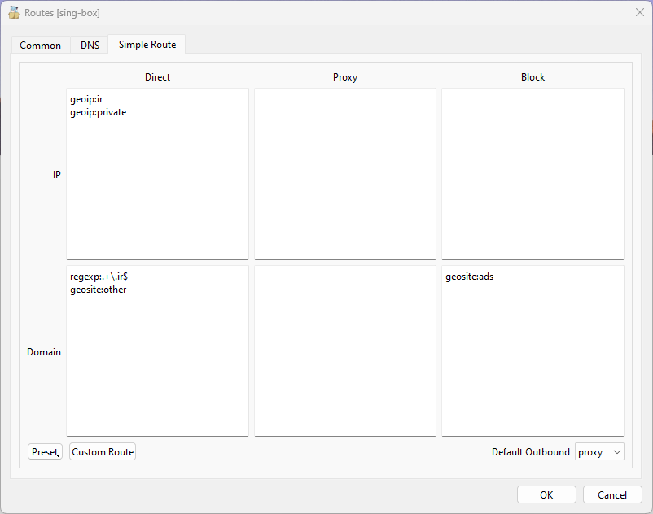
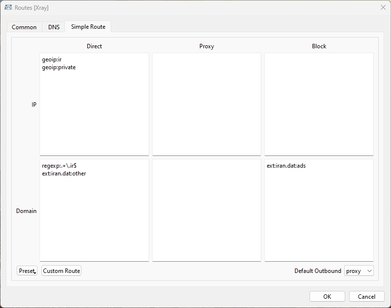

# Nekoray / Nekobox (Desktop)

You can find Nekoray for desktop from [here](https://github.com/MatsuriDayo/nekoray)

## Routing

Nekoray can use both sing-box and Xray cores. Please use the corresponding routing rules according to your selected Nekoray core.

?> :information_source: You can see or switch your current Nekoray core by going to `preferences` > `Basic Settings` > `Core`.

### sing-box core

1. Download the latest version of [iran-geosite.db](https://github.com/bootmortis/iran-hosted-domains/releases/latest/download/iran-geosite.db)
2. Rename it to `geosite.db`.
3. Rename `geosite.db` in Nekoray folder to `backup-geosite.db`.
4. Copy the downloaded `geosite.db` to Nekoray folder.
5. Open `preferences` and click on `Routing Setting`.
6. Go to `Simple Route` tab.
7. Copy the following lines to the corresponding fields:

-   `Direct, IP`

```
geoip:ir
geoip:private
```

-   `Direct, Domain`

```
geosite:all
```


-   `Proxy, Domain`

```
geosite:proxy
```

-   `Block, Domain`

```
geosite:ads
```

8. Press OK button and restart the app.

!> **Important**: By changing the default `geosite.db`, you can't use default geosite categories like `category-ads-all`. You can switch back to default geosite by removing the new `geosite.db` and renaming `backup-geosite.db` back to `geosite.db`. You can also download the original `geosite.db` from [sing-geosite](https://github.com/SagerNet/sing-geosite/releases).



### Xray core

1. Download the latest version of [iran.dat](https://github.com/bootmortis/iran-hosted-domains/releases/latest/download/iran.dat).
2. Copy `iran.dat` to Nekoray folder.
3. Open `preferences` and click on `Routing Setting`.
4. Go to `Simple Route` tab.
5. Copy the following lines to the corresponding fields:

-   `Direct, IP`

```
geoip:ir
geoip:private
```

-   `Direct, Domain`

```
ext:iran.dat:all
```

-   `Proxy, Domain`

```
ext:iran.dat:proxy
```

-   `Block, Domain`

```
ext:iran.dat:ads
geosite:category-ads-all
```

6.  Press OK button and restart the app.


