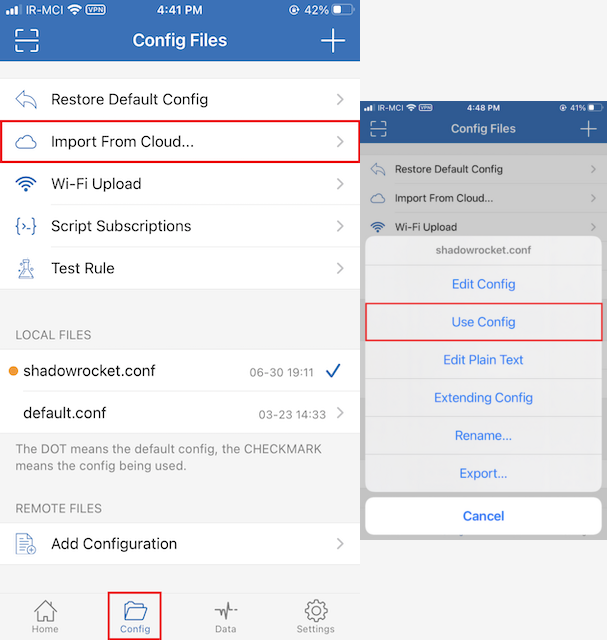

# Shadowrocket (iOS)

You can find the Shadowrocket client for iOS [here](https://apps.apple.com/us/app/shadowrocket/id932747118).

## Routing

1. Download the latest version of [shadowrocket.conf](https://github.com/bootmortis/iran-hosted-domains/releases/latest/download/shadowrocket.conf)
2. Tap `Import From Cloud` in the Shadowrocket app and then import the file.
3. Finally, tap on the `shadowrocket.conf` and select `Use Config`.

